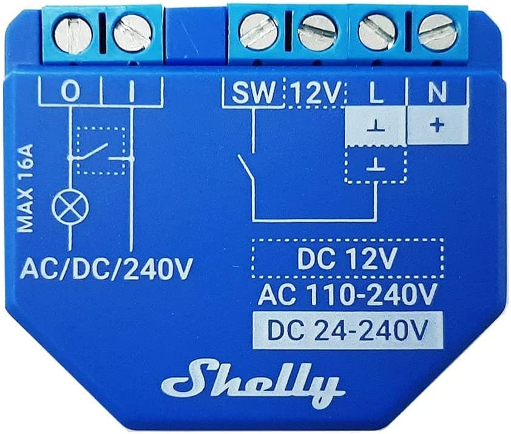
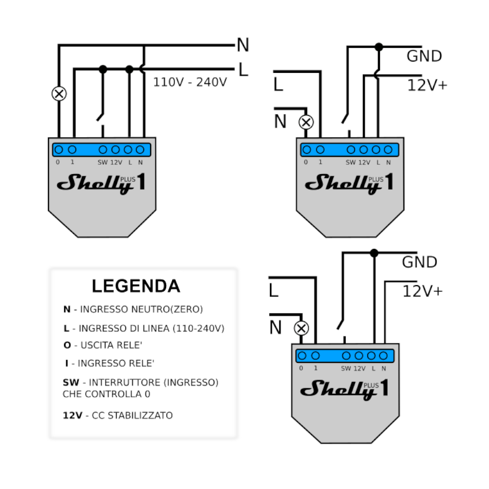
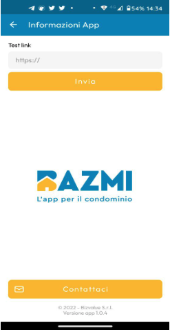
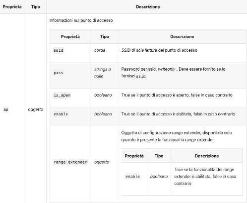
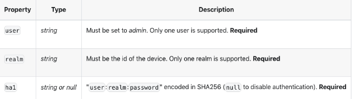
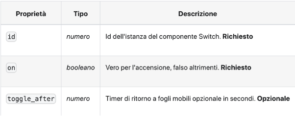
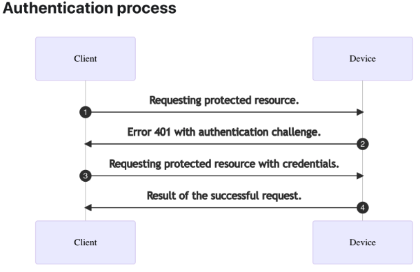

<h1>Integrazione BazMe Apri Cancello</h1>

Questo documento descrive l’integrazione tra l’applicazione BazMe e i device Shelly con lo scopo di dare la possibilità di accesso ad apparati con elettroserrature 12v o 220v.<br/>>
Il device Shelly1 Plus d’ora in poi denominato Shelly può essere alimentato sia con una tensione di 12v oppure con una tensione a 220v.<br/>
Lo Shelly permette possiede un rele a 220v al suo interno azionabile attraverso dei comandi.<br/>
Questi comandi possono essere inviati utilizzando una serie di protocolli, quali: HTTP, RPC, WebSocket, MQTT e UDP. <br/>

In questo progetto utilizzeremo l’interfaccia RPC con un device Shelly1 Plus (Fig.1). <br/>




Fig. 1

Per eseguire un reset di fabbrica del device basta premere per 10 secondi il pulsante sul retro del device.<br/>
Il reset comporterà la perdita di tutte le configurazioni e il device verrà riportato allo stato iniziale.<br/>

<h2>Installazione Hardware</h2>

Lo Shelly ha due possibilità di alimentazione 220v o 12v .<br/>
Il collegamento va effettuato di conseguenza seguendo uno dei seguenti schemi:<br/>



In questo schema si possono vedere i collegamenti dei carichi da effettuare sui pin O e I a sinistra dello Shelly.<br/>


<br/>

<h2>Installazione Software</h2>

Lo Shelly crea un hotspot WiFi denominato ShellyPlus1-XXXXXXXXXXXX. <br/>
La parte XXXXXXXXXXX dipende dal numero di serie ad esempio ShellyPlus1-7C87CE720AD8.<br/>
Per effettuare la configurazione nell’App BazMe seguire i seguenti passi:<br/>


1. Collegarsi alla rete WiFi creata dallo Shelly (ShellyPlus1-XXXXXXXXXXXX) con il telefono.<br/>
2. Selezionare l’entità a cui si vuole aggiungere il device (es.: Condominio Via Maffucci).<br/>
3. Premere il pulsante ** Configura Nuovo Device**.<br/>
4. Al termine della configurazione verrà creato un nuovo Device nell'elenco come in Fig. 2.<br/>




 Fig. 2

Per effettuare un test di funzionamento cliccare il nuovo device creato e premere **‘Apri’**.

<h2>Configurazione punto di accesso WiFi</h2>

Il device possiede un DHCP interno ed assegnerà un ip a chiunque si colleghi al suo WiFi che al momento dell’installazione è open e senza password.<br/>
L’ip dello Shelly sarà sempre **192.168.3.1**.<br/>
Ne consegue che dovremmo proteggere sia l’accesso al WiFi che ai relativi comandi.<br/>
Iniziamo con la configurazione della password del WiFi.<br/>


* **Settaggio password di protezione su WiFi AP (Access Point)**

    **[WiFi.SetConfig](http://IPDEVICE/rpc/WiFi.SetConfig?config={"ap":{"ssid":"ShellyPlus1-7C87CE720AD8","pass":"NuovaPassword","enable":true)**


Questo comando assegna una password (**NuovaPassword**) alla rete WiFi creata dal device e va lanciato come primo comando subito dopo la connessione alla sua rete Wifi.<br/>


```
http://192.168.33.1/rpc/WiFi.SetConfig?config={"ap":{"ssid":"ShellyPlus1-7C87CE720AD8","pass":"NuovaPassword","enable":true}}
```


Il comando è** WiFi.SetConfig** a cui viene passato un json contenente vari parametri tra cui la password. Qui sotto i vari parametri possibili.<br/>




Il parametro SSID rappresenta il punto di accesso WiFi che si vuole configurare.<br/>
Il parametro PASS è la password da settare.<br/>
Il parametro ENABLE deve essere impostato a true.<br/>
<br/>
* **Esempio: shellySetWiFi()**
<br/>

<h2>Configurazione accesso ai comandi del device</h2>

Il device espone dei comandi che permettono di utilizzare i servizi offerti dallo Shelly.<br/>
Per proteggere tutti i comandi è necessario proteggere con una password il loro utilizzo.<br/>
L’ip del device sarà sempre **192.168.3.1**.<br/>


    **<span style="text-decoration:underline;">Shelly.SetAuth</span>**





Parametri:


* **user**: Deve sempre essere **admin**
* **realm**: Nome del device che si sta configurando. Es.:SellyPlus1-XXXXXXX<br/>
* **ha1**: SHA256 della stringa seguente user:realm:password<br/>

In questo esempio viene configurata per il device **shellyplus1-7c87ce720ad8** una password ‘**NuovaPassword’**
Per ottenere il parametro **ha1** avviene calcolato lo SHA256 di una stringa così composta user:realm:password.<br/>

<br/>
* **Esempio: shellySetAuth()**
<br/>

 **admin:shellyplus1-7c87ce720ad8:NuovaPassword**

Lo sha256 di questa stringa è:<br/>

**7a89f0e64fac6814c3e5281dd0698532bc93d7d7f20ccf8ae995dcd58c22c8a7**

Il comando da inviare al device per configurare l’accesso ai comandi è il seguente:<br/>


```
http://192.168.33.1/rpc/Shelly.SetAuth?user="admin"&realm="shellyplus1-7c87ce720ad8"&ha1="7a89f0e64fac6814c3e5281dd0698532bc93d7d7f20ccf8ae995dcd58c22c8a7"
```

<br/>
<br/>


<h2>Azionamento attuatore (relè) per un tempo stabilito</h2>

E’ possibile azionare l'attuatore (relè) all'interno del device per un tempo stabilito.<br/>

L’ip del device sarà sempre **192.168.3.1**.<br/>


    **<span style="text-decoration:underline;">Switch.Set</span>**





Il parametro **ID** rappresenta sempre 0 (zero).<br/>
Il parametro **ON** true = acceso, false = spento.<br/>
Il parametro **TOGGLE_AFTER** rappresenta il numero di secondi in cui il dispositivo aziona il relè.<br/>


```
http://192.168.33.1/rpc/Switch.Set?id=0&on=true&toggle_after=1 
```
<br/>
* **Esempio: shellySetAuth()**
<br/>

<br/>
<br/>


<h2>Autenticazione ()</h2>

L’accesso ai comandi è protetto da autenticazione di tipo DIGEST. <br/>
Per comandare il relè del device o accedere a qualsiasi comando, sono necessari due passaggi (Fig.3).<br/>
La richiesta deve essere una (**GET**) così composta:<br/>


```
http://192.168.33.1/rpc/Switch.Set?id=0&on=true&toggle_after=1 
```

Il comando andrà inviato **due volte**.<br/>

La **prima** andrà in errore **401 Unauthorized** ma fornirà alcuni parametri necessari alla **seconda** richiesta di autenticazione.<br/>

Di seguito un diagramma di funzionamento.<br/>




Fig. 3

Dopo la prima richiesta il device fornirà i parametri necessari alla composizione della seconda richiesta.<br/>
Alla seconda richiesta è necessario aggiungere un header di autenticazione.<br/>

      Authorization: `Digest username="admin", realm="${result.realm}", nonce=${result.nonce}, uri=${result.uri}, algorithm="SHA-256", qop=${result.qop}, nc=${result.nc}, cnonce=${result.cnonce}, response=${result.resp}`


* `realm`: stringa, identificativo device. **Obbligatorio**
* `username`: stringa, deve essere sempre _admin_. **Obbligatorio**
* `nonce`: numero, numero random ottenuto dall’header dalla prima richiesta fallita con errore 401 random . **Obbligatorio**
* `uri`: identificativo del device (es.: shellyplus1-7c87ce7213ec) . **Obbligatorio**
* `algorithm`: stringa, deve essere sempre _sha256_ . **Obbligatorio**
* `qop`: stringa, deve essere sempre _auth_ . **Obbligatorio**
* `nc`: stringa, numero della richiesta. usare _00000001_ . **Obbligatorio**
* `cnonce`: numero, numero random generato dal client. **Obbligatorio**
* `algorithm`: stringa, _SHA-256_. **Obbligatorio**
* `response`: stringa, SHA256 della stringa così composta: 


    * `ha1`: stringa, `user:realm:password` encoded in SHA256
    * `ha2`: stringa, "method:uri" encoded in SHA256

  const ha1 = crypto.createHash('sha256').update(`${username}:${realm}:${password}`).digest('hex');</br>
  const ha2 = crypto.createHash('sha256').update(`${method}:${uri}`).digest('hex');</br>
  const response = crypto.createHash('sha256').update(`${ha1}:${nonce}:${nc}:${cnonce}:auth:${ha2}`).digest('hex');</br>


